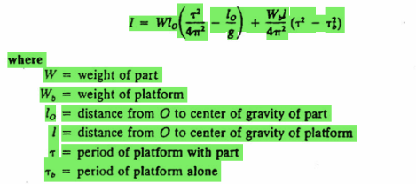
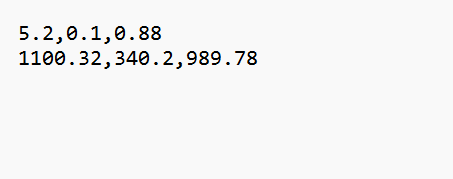

# PSU UAV Capstone Library
## Table of Contents
1. [Library Overview](#library-overview)
    1. [Full System Code](#full-system-code)
    2. [Individual Code](#individual-code)
    3. [Python Tests](#python-tests)
2. [Full System Code Functions](#full-system-code-functions)
    1. [`setup()`](#void-setup)
    2. [`loop()`](#void-loop)
    3. [`PerformOscillation()`](#void-performoscillationint-direction)
    4. [`get_period()`](#float-get_periodfloat-values)
    5. [`detect_peak()`](#bool-detect_peakfloat-values-int-centerindex-int-size)
    6. [`moving_avg_filter()`](#moving-average-filter)
    7. [`CalculateMMI()`](#float-calculatemmifloat-period-float-lo-int-axis)
    8. [`CalculateCG()`](#float-calculatecgfloat-frontweight-float-leftweight-float-rightweight-float-referencepoint-int-dir)
    9. [micro SD output](#micro-sd-card-output)
3. [External Libraries Used](#external-libraries)
## Library Overview
The purpose of this library is to automate the UAV Mass Properties Testing Apparatus created for the Fall 2024 Learning Factory Capstone. The code was created to work with the Teensy 4.1 in the Arduino IDE. 

The library is split up into three folders: Full System Code, Individual Code, and Python Tests.

### Full System Code
This .ino script is what controls the Teensy 4.1 for the full testing process from start to finish. It controls the gyroscope, load cells, load cell amps, keypad, and LCD screen.

### Individual Code
These .ino scripts were used for testing. The most useful tests are the *HX711_calibration* and *period_detection*.

#### *HX711_calibration*
This script allows all three load cells to be calibrated at once. For our calibration, we positioned them equidistant from the center of a platform and then place weights on the center of the platform, aligning the CoG's. 

Calibration uses the following script. Adjust each load cell's calibration factor by inputting the corresponding character into the Arduino IDE's serial monitor.
```cpp
  if(Serial.available())
  {
    char temp = Serial.read();
    if(temp == '1')
      calibration_factor1 += 1000;
    else if(temp == '!')
      calibration_factor1 -= 1000;
    else if(temp == '2')
      calibration_factor2 += 1000;
    else if(temp == '@')
      calibration_factor2 -= 1000;
    else if(temp == '3')
      calibration_factor3 += 1000;
    else if(temp == '#')
      calibration_factor3 -= 1000;
  }
```

#### *Period Detection*
This is a rudimentary version of the peak detection algorithm used in the Full System Code that calculates the period of gyroscope readings. It is described in more detail at INSERT LINK HERE.

### Python Tests
These were prototyping tools created in Python for simple creation. They were then translated in C++ for the Arduino IDE.

#### *periodTest.py*
This script generates a noisy sine wave, denoises the wave, and then calculates its period by detecting peaks along the wave. A simple moving average filter removes high frequency noise. Parameters allow for the strength of those filters and the peak detection to be altered.

#### *capstoneCG.py*
This is a simple Center of Gravity algorithm test that was translated into the Full System Code for the final product.

## Full System Code Functions
### `void setup()`
#### Description
This function is called every time the Teensy 4.1 is powered on. It initializes sensors, checks for bad connections, and then enters the main menu loop. All sensors should be connected when power is connected so that these initial checks can be completed. However, after completing CoG calculations, the load cells can be safely disconnected and reconnected at any time.

#### Error Messages
**GYRO FAIL**: Check gyroscope wiring.

**SD CARD FAIL**: Check SD card connection into Teensy. I know this sounds too simple, but one fix we found for this error was simply unplugging and replugging the micro SD card back into its holder.

### `void loop()`
#### Description
Called every frame once power is connected. The loop handles keypad inputs and switch menu states. It also enables gyroscope sampling and the CoG live update screen.

#### *int menuState*
This variable changes depending on what menu the LCD screen currently displays. It is altered by all the Menu Handler Functions but it is checked everytime a key is pressed to know which Menu Handler to enter.

```cpp
  char key = customkeypad.getKey();  // Continuously read key press from the keypad

  if (key != NO_KEY) {  // If a key is pressed
    if (menuState == 0) {
      handleMainMenu(key);  // Handle main menu key presses
    }
```

#### Menu Handler Functions
There are a total of 16 Menu Handler Functions. Each one takes a `char key` as an input. Based on the key entered, it updates *menuState* and prints the next menu to the LCD screen. For certain menus, like *handleInertiaXOscillate*, the final inertia calculation function call occurs in the handler after the user presses '1'.

```cpp
void handleInertiaXOscillate(char key) {
  if (key == '#') {
    inertia_x_screen();    // Go back to Inertia X screen
    x_oscillated = false;  //reset oscillation
    menuState = 6;
  } else if (key == '1') {  // Save the X oscillation
    x_mmi_final = CalculateMMI(x_period, uav_cog_distance_x, 1); // Function call to Calculate MMI
    lcd.clear();
    lcd.print("X Oscillation Saved");
    delay(1000);
    if (!y_oscillated || !z_oscillated) {  // Check if Y or Z oscillation is pending
      displayInertiaMenu();                // Redirect to Y oscillate
      menuState = 2;
    } else {
      displayResultsScreen(resultChoice);  // Show results for Inertia
      menuState = 14;                      // Transition to results screen state
    }
  }
}
```

### `void PerformOscillation(int direction)`
#### Description
This function takes in the oscillation axis the user currently wants to measure as *int direction* (x = 1, y = 2, z = 3) and calculates the period of the oscillation in that axis.

#### Use Case
The function is called when the user presses "Start Oscillate" on any of the axis oscillation menus. Once '1' is pressed, this function immediately begins running so start the oscillation before pressing '1'.

On the first call, the oscillation is initialized:
```cpp
  if (!isRecording) {
    isRecording = true;
    startTime = millis();  // Record the starting time
    sample_index = 0;      // Reset index for new recording
  }
```

After this initialization, the loop calls this function every frame with the following if statement:

```cpp
  if (menuState == 8) {  //X INERTIA
    if (!x_oscillated) {
      PerformOscillation(1);  //
    }
  }
```

Everytime `PerformOscillation` is called from that point onwards, it samples from the gyroscope and holds all the values with their corresponding times in an array. 

```cpp
    //Save data and time for period calculation
    sensor_data[sample_index] = data;
    time_data[sample_index] = millis();
    sample_index++;
```

After *float duration* seconds, the sampling stops by setting *isRecording* to false and the period is calculated. The period is saved into the axis' respective period variable (*x_period*, *y_period*, or *z_period*) and then the period is printed to the LCD.

To change sample parameters, alter the *duration* and *sampleRate* variables.

### `float get_period(float values[])`
#### Description
This function is called by `PerformOscillation` to get the period of the array *values[]*. Based on the variable *peakSize*, it looks for peaks and calculates the time inbetween each peak occuring. It returns an average of all the periods it finds in *values[]*.

#### *int peakSize*
The algorithm iterates through each number in *values[]* and checks values -*peakSize* and +*peakSize* above the current element by using the `detect_peak` function.

### `bool detect_peak(float values[], int centerIndex, int size)`
#### Description
Returns True if the item at *centerIndex* is a peak and returns False otherwise.

#### Peak Detection
Peak detection occurs by checking the values -*size* and +*size* around the value at *values[centerIndex]*. If that value is greater than all the other values around it, then it is a peak.

### `void moving_avg_filter(float values[], int size, float filtered[])`
#### Description
This function takes in *values[]* and *size* and fills in the *filtered[]* array with denoised data from *values[]*. `PerformOscillation` calls this function in order to avoid detecting periods due to noise.

#### Moving Average Filter
This function uses a simple sliding window approach. It keeps track of the sum of the values from -*size* to +*size* around the current element and averages them together. It then replaces the current element with that average.

```cpp
  //Sliding window technique
  for (int i = size + 1; i < arraySize - size; i++) {
    sum = sum - values[i - size - 1] + values[i + size];
    filtered[i] = sum / windowSize;
  }
```

### `float CalculateMMI(float period, float lo, int axis)`
#### Description
This function calculates the MMI for the UAV for each *axis* (x = 1, y = 2, z = 3). *float lo* is the distance from the UAV CoG to the rotation point which is calculated based on the CoG measured by the load cells and changes depending on the axis entered.
#### Equation
This is the equation used:


Many of the variables are written as constants at the top of the script.

### `float CalculateCG(float frontWeight, float leftWeight, float rightWeight, float referencePoint, int dir)`
#### Description
Based on the *dir* entered (x = 1, y = 2, z = 3), the CoG is calculated using the 3 Load Cell scale values. The CoG is calculated based on the *float referencePoint*. This means the simple CoG is calculated from the scale readings and then the referencePoint is subtracted to give the distance between those two points.

#### Example CoG Calculation
```cpp
//Simple weighted average
cg = ((frontWeight - platform_front_weight) * front_scale_pos[0] + (leftWeight - platform_left_weight) * left_scale_pos[0] + (rightWeight - platform_right_weight) * right_scale_pos[0]) / (modelWeight);
```

### micro SD Card output
#### Description
The micro SD card output is written in the following format as a .txt file:



First Line: X CoG, Y CoG, Z Cog

Seconds Line: X MMI, Y MMI, Z MMI

#### Center of Gravity Results
The X CoG is calculated as the difference between the nose position entered on the LCD screen and the calculated load cell CoG.

The Y CoG is calculated as the difference of the Y CoG off the center line running down platform.

The Z CoG is calculated similar to the X.

## External Libraries
1. [Load Cell Amps (HX711)](https://github.com/bogde/HX711)
2. [Liquid Crystal I2C](https://github.com/johnrickman/LiquidCrystal_I2C)
3. [Adafruit LSM6SOX](https://github.com/adafruit/Adafruit_LSM6DS/tree/master)
4. [Teensy Setup for Arduino IDE](https://www.pjrc.com/teensy/td_download.html)
